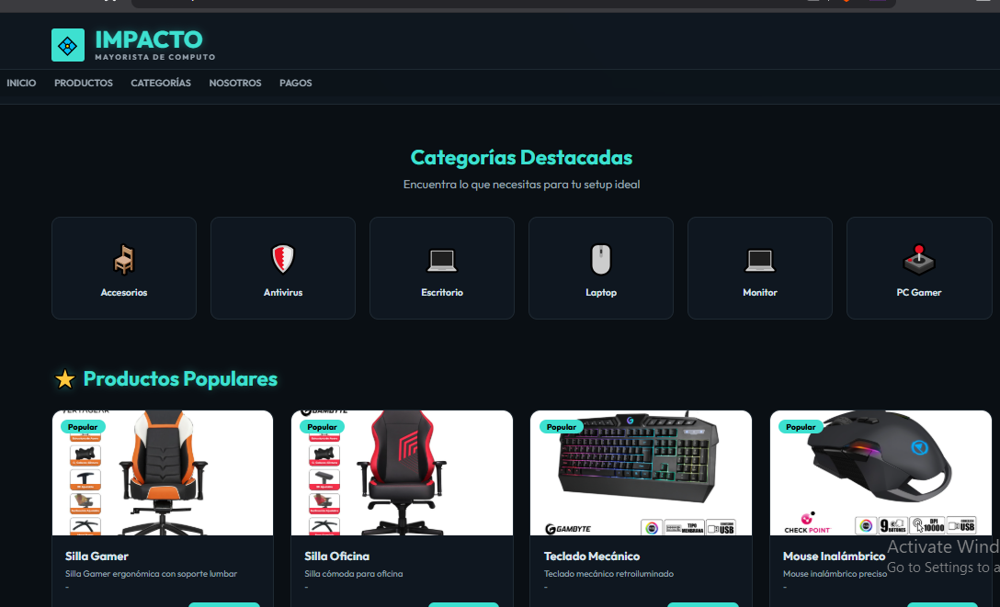
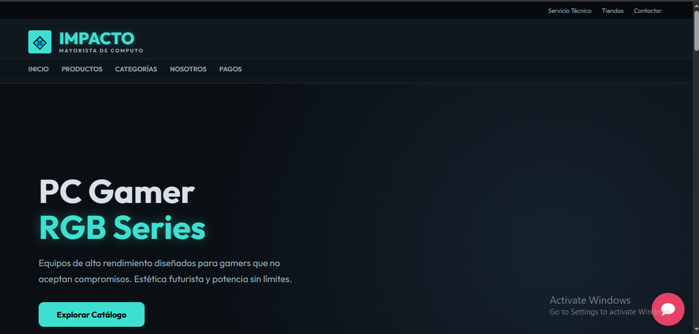
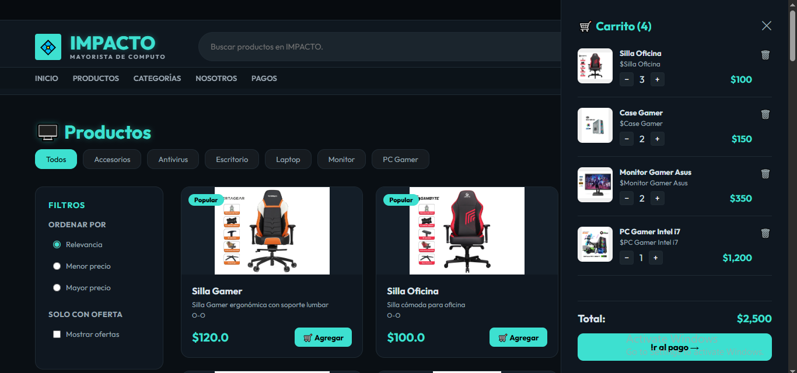
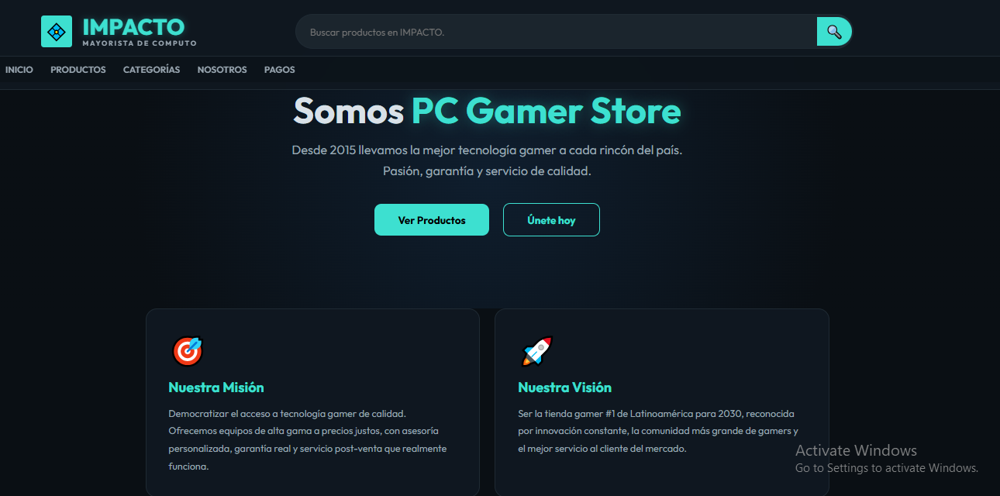
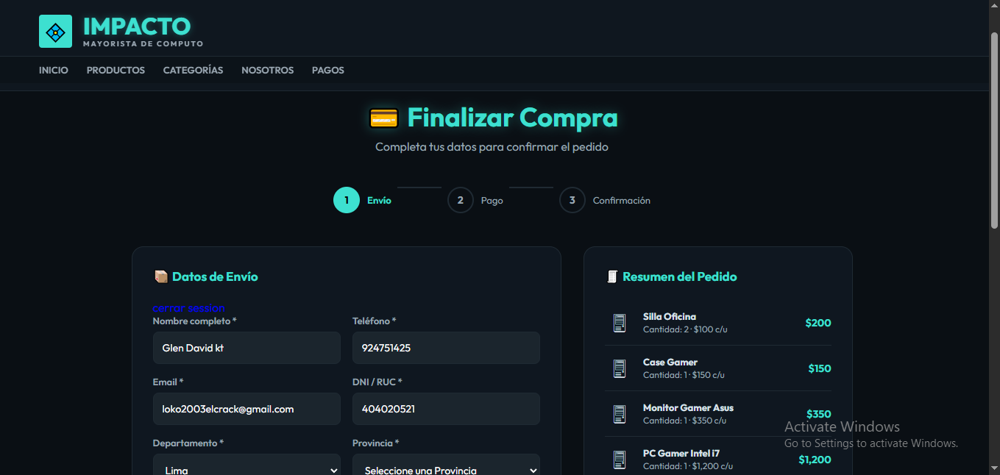
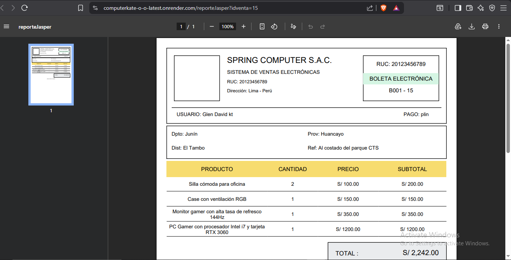

# 🖥️ ComputerKate_O_O - Sistema E-Commerce de Computadoras



---

# 📝 Descripción del Proyecto

**ComputerKate_O_O** es un sistema web e-commerce desarrollado con **Java Web (JSP + Servlets)** aplicando el patrón de arquitectura **MVC**, programación orientada a objetos (**POO**) y buenas prácticas de desarrollo backend.

El proyecto fue creado con el objetivo de simular una tienda virtual de productos tecnológicos, permitiendo gestionar productos, categorías, carrito de compras, ventas, reportes y filtros dinámicos.

Además, el sistema implementa integración con base de datos MySQL, AJAX, despliegue con Docker y hosting cloud utilizando Render y Railway.

---

# 🎯 Objetivo del Proyecto

Desarrollar una plataforma web dinámica y escalable que permita:

- 🛒 Gestionar productos tecnológicos
- 👤 Manejar usuarios y ventas
- 📦 Implementar carrito de compras
- 🔍 Realizar filtros y búsquedas dinámicas
- 📊 Generar reportes
- ☁️ Desplegar aplicaciones Java usando Docker

---

# ⚙️ Tecnologías Utilizadas

<p align="center">


</p>

---

# 🧠 Arquitectura Implementada

El proyecto sigue una arquitectura basada en el patrón **MVC (Model - View - Controller)**.

---

## 📂 Config

Encargado de:

- Configuración de conexión a base de datos
- Implementación del patrón Singleton
- Gestión centralizada de conexiones

---

## 🧩 Models / Entities

Representación de entidades del sistema:

- Producto
- Usuario
- Venta
- Categoría
- Carrito
- DetalleVenta

Incluye:

- Atributos
- Encapsulamiento
- Constructores
- Métodos getter y setter

---

## 🗄️ Repository

Capa encargada de acceso a datos.

### Implementación:

- Interfaces Repository
- Clases concretas que implementan interfaces
- Consultas SQL
- CRUD completo
- Procedures
- INNER JOIN
- UNION

---

## ⚙️ Service

Capa donde se maneja:

- Lógica de negocio
- Validaciones
- Reutilización de código
- Comunicación entre Controller y Repository

Actualmente algunas implementaciones se manejan directamente sin interfaces para evitar sobrecomplejidad innecesaria.

---

## 🎮 Controller

Controladores Servlet encargados de:

- Recibir peticiones HTTP
- Procesar formularios
- Manejar validaciones
- Redireccionar vistas
- Comunicarse con Service

Ejemplo usando AJAX:

```javascript
fetch('VentaServlet', {
    method: 'POST',
    headers: {
        'Content-Type': 'application/json'
    },
    body: JSON.stringify(data)
})
```

---

## 🖼️ Views

Sistema de vistas desarrollado con:

- JSP
- HTML
- CSS
- JavaScript
- AJAX

Encargadas de:

- Mostrar información
- Formularios
- Interfaz visual
- Carrito de compras
- Panel de productos

---

# 🚀 Funcionalidades del Sistema

## 👤 Gestión de Usuarios

- Registro de usuarios
- Inicio de sesión
- Validaciones
- Control de acceso

---

## 🛒 Carrito de Compras

- Agregar productos
- Eliminar productos
- Actualizar cantidades
- Calcular total de compra

---

## 🔍 Búsquedas y Filtros

- Filtro por categorías
- Búsqueda dinámica
- Ordenamiento por precio
- Productos destacados

---

## 📦 Gestión de Productos

- CRUD completo
- Categorías
- Stock
- Imágenes

---

## 💳 Ventas

- Registro de ventas
- Generación de comprobantes
- Historial de compras

---

## 📊 Reportes

Implementación usando:

- JasperReports

Reportes:

- Ventas
- Productos
- Usuarios
- Historial

---

# 🌟 Características Técnicas

✅ Arquitectura MVC  
✅ Programación Orientada a Objetos  
✅ Uso de Interfaces  
✅ AJAX  
✅ Validaciones Backend y Frontend  
✅ MySQL  
✅ Procedures SQL  
✅ Docker  
✅ Deploy en Render  
✅ Base de datos desplegada en Railway  
✅ Sistema escalable y reutilizable  

---

# ☁️ Deploy y Hosting

## 🚀 Render

Deploy del proyecto Java Web utilizando:

- Docker
- Apache Tomcat 8.5
- JDK 1.8

---

## 🗄️ Railway

Hosting de base de datos MySQL usando:

👉 https://railway.com/new

---

# 📸 Capturas del Proyecto

| Vista | Imagen |
|------|------|
| 🏠 Página Principal |  |
| 🛒 Carrito de Compras |  |
| 📦 Nosostros |  |
| 💳 Pagos |  |
| 📊 Reportes |  |

---

# 🧩 Estructura del Proyecto

```bash
ComputerKate_O_O/
│
├── Config/
├── Controllers/
├── Services/
├── Repository/
├── Models/
├── Utils/
├── JSP/
├── AJAX/
├── Reports/
├── SQL/
└── Docker/
```

---

# 📌 Mejoras Pendientes

## 🔥 Tareas por Realizar

- [ ] Reestructurar mejor MVC
- [ ] Reutilización de código
- [ ] Convertir carrito completamente a JavaScript
- [ ] Filtros dinámicos con AJAX
- [ ] Manejo de errores desde backend
- [ ] Formulario de pagos
- [ ] Integrar Departamentos / Provincias / Distritos
- [ ] Mejorar reportes
- [ ] Optimizar módulo de ventas
- [ ] Deploy de proyecto final con Docker
- [ ] Mejorar seguridad
- [ ] Mover vistas a WEB-INF

---

# 💡 Lo Aprendido

Durante el desarrollo del proyecto se reforzaron conocimientos en:

- Arquitectura MVC
- Java Web
- Servlets
- JSP
- AJAX
- Docker
- MySQL
- SQL avanzado
- Deploy en la nube
- Programación orientada a objetos
- Patrones de diseño

---

# 👨‍💻 Autor

## 🧑‍💻 loko0055x David

📚 Proyecto académico y de práctica profesional enfocado en backend Java y arquitectura web.

---

# ✨ Estado del Proyecto

✅ En desarrollo  
🚀 Escalable  
💻 Preparado para futuras mejoras

---

> 📢 “La programación no solo consiste en que funcione, sino en estructurarlo correctamente para que pueda crecer.”
